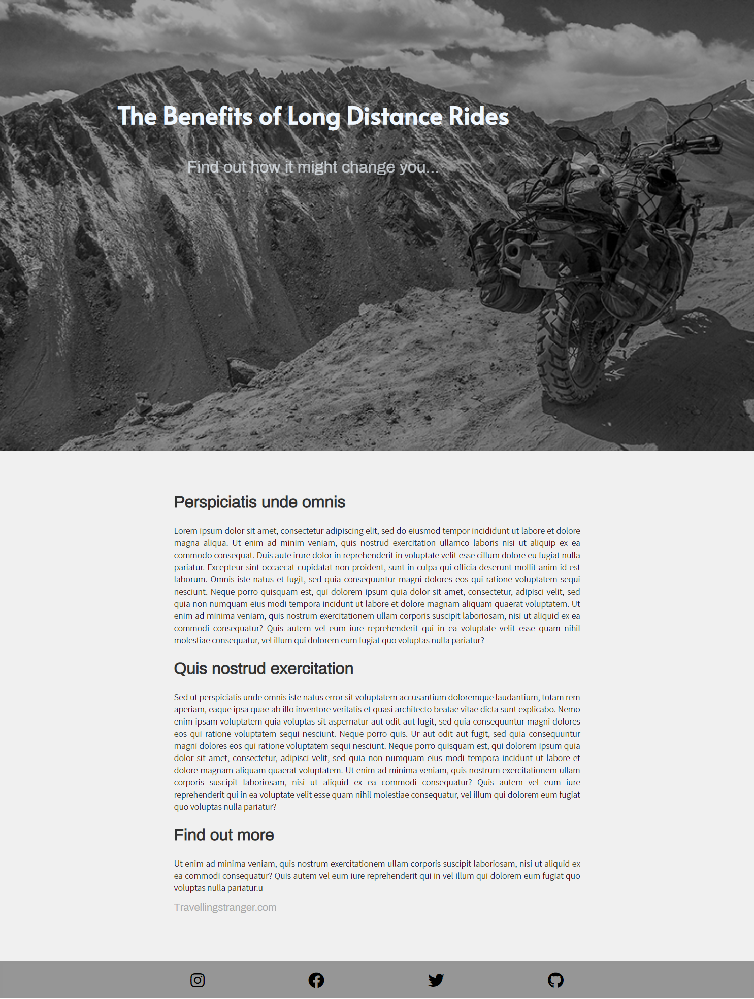

# Medium-Page

##General info
A landing page built on HTML and CSS made just to practice some basic design features. Icons from FOntsAwesome and links to my own social media and web pages. The page is responsive meaning that it qadapts to different screen sizes on different devices. 

## Screenshot

## Technologies
Current HTML 5 and CSS 3. This is all this exercise was meant to be. No use of Bootstrap or Flexbox or other.

## Setup
Dowload all files and then drag the index.html file into any browser of your choice. My personal favourite is Brave (browser).

## Status 
Finished

## Inspirtion
Just practicing some basic front end design features i've learned 😀
